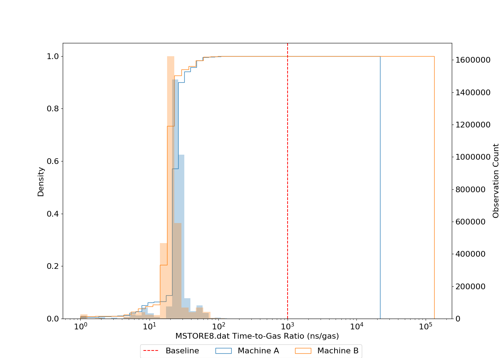
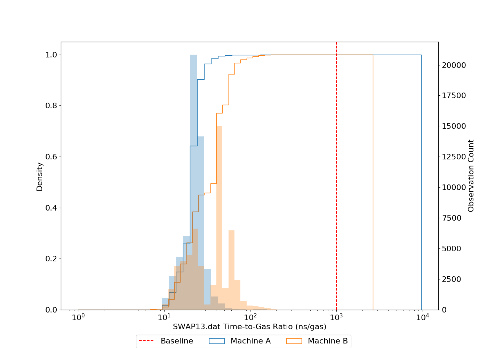
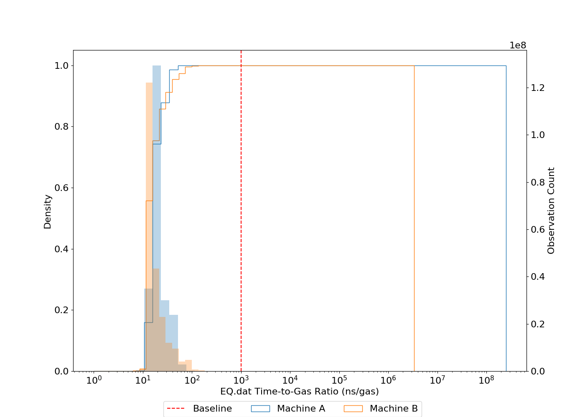
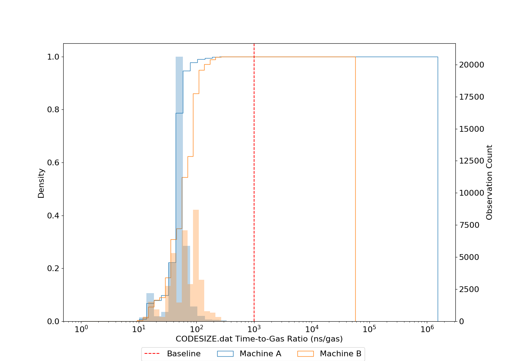

Paper: https://arxiv.org/abs/1905.00553

```python
"""How the plots are generated:
import os
import numpy as np
import matplotlib as mpl
mpl.use('Agg')
import matplotlib.pyplot as plt
import concurrent.futures as conc
mpl.rc('font', size=16)

WIDTH=14
HEIGHT=10

OUTPUT_DIR="/scratch/[REDACTED]/SNB2019-PLOTS/"

datafiles = os.listdir('/scratch/[REDACTED]/muppet-ops')

fig, axes = plt.subplots(1, 1, figsize=(WIDTH,HEIGHT))
axes.set_ylabel('Density')

def plot(filename):
    fig, axes = plt.subplots(1, 1, figsize=(WIDTH,HEIGHT))
    axes.set_ylabel('Density')

    try:  
        muppetRatios = np.fromfile('/scratch/[REDACTED]/muppet-ops/{}'.format(filename),
          dtype=float, sep='\n')
        loulaRatios = np.fromfile('/scratch/[REDACTED]/loula-ops-data/{}'.format(filename),
          dtype=float, sep='\n')

        axes.set_xscale('log')
        axes.set_xlabel('{} Time-to-Gas Ratio (ns/gas)'.format(filename))
        ax = axes.twinx()
        ax.set_ylabel('Observation Count')

        muppetlogbins = np.geomspace(1, muppetRatios.max())
        loulalogbins = np.geomspace(1, loulaRatios.max())

        ax.hist(muppetRatios, bins=muppetlogbins,\
          alpha=0.3,\
          label="Machine A")
        axes.hist(muppetRatios, bins=muppetlogbins,\
          histtype='step', density=True,
               cumulative=True)
        ax.hist(loulaRatios, bins=loulalogbins,\
          alpha=0.3,\
          label="Machine B")
        axes.hist(loulaRatios, bins=loulalogbins,\
          histtype='step', density=True, cumulative=True)
        axes.axvline(1000, ls='--', color='r', label="Baseline")
        fig.legend(["Baseline", 'Machine A', 'Machine B'], loc="lower center",
        ncol=3, borderaxespad=0)
        plt.savefig(OUTPUT_DIR + "{}".format(filename[:-4] + '.png'))
    except ValueError:
        return


with conc.ProcessPoolExecutor(max_workers=32) as e:
    e.map(plot, datafiles)
"""

PLOT_DIR='/scratch/[ANON]/SNB2019-PLOTS/'

from IPython.display import Image, display
import os


plots = os.listdir(PLOT_DIR)
for i in range(0, len(plots)):
    print(plots[i])
    display(Image(filename=(PLOT_DIR+plots[i])))
```

    DUP3.png


    ORIGIN.png


    MSTORE8.png





    GT.png


    MOD.png


    CALLVALUE.png


    PUSH3.png


    AND.png


    SWAP1.png


    SWAP14.png


    ISZERO.png


    GAS.png


    POP.png


    LOG2.png


    JUMPCI.png


    BLOCKHASH.png


    SSTORE.png


    DUP10.png


    BYTE.png


    PUSH2.png


    DUP9.png


    SWAP13.png





    PUSH5.png


    SWAP2.png


    SUICIDE.png


    EQ.png





    SWAP9.png


    SUB.png


    DUP15.png


    BALANCE.png


    SWAP8.png


    GASLIMIT.png


    PUSHC.png


    MLOAD.png


    JUMPDEST.png


    JUMPI.png


    PUSH1.png


    DUP13.png


    SWAP7.png


    EXTCODESIZE.png


    DUP7.png


    SWAP4.png


    CALLDATALOAD.png


    MUL.png


    DUP14.png


    DUP16.png


    CALLER.png


    SIGNEXTEND.png


    MSTORE.png


    DUP1.png


    SWAP5.png


    DIV.png


    SWAP11.png


    GASPRICE.png


    SWAP12.png


    OR.png


    XOR.png


    CODECOPY.png


    MULMOD.png


    NUMBER.png


    DUP4.png


    PC.png


    SWAP6.png


    ADDMOD.png


    DUP12.png


    LT.png


    JUMP.png


    EXTCODECOPY.png


    COINBASE.png


    DUP2.png


    LOG0.png


    SWAP3.png


    ADDRESS.png


    SWAP16.png


    RETURN.png


    TIMESTAMP.png


    LOG3.png


    SMOD.png


    DUP11.png


    PUSH4.png


    DUP5.png


    CALLDATACOPY.png


    ADD.png


    DUP6.png


    LOG1.png


    DIFFICULTY.png


    SHA3.png


    SWAP10.png


    SGT.png


    SLT.png


    SDIV.png


    LOG4.png


    JUMPC.png


    EXP.png


    NOT.png


    SWAP15.png


    DUP8.png


    CALLDATASIZE.png


    SLOAD.png


    CODESIZE.png





    MSIZE.png


```python
print("total number of plots: " + str(len(plots)))
```

    total number of plots: 101


```python
# Traces are available at:
```
